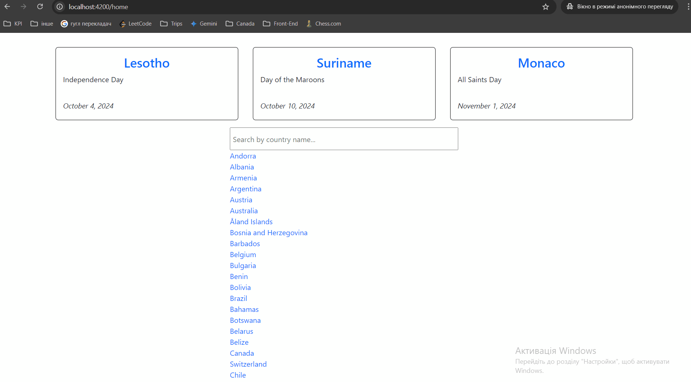

<h1 align="center">Country Explorer</h1>

--- 
## Description
Explore the world with **Country Explorer** — your gateway to discovering countries, their unique holidays, and neighboring nations. 
Dive into the API documentation [here](https://date.nager.at/swagger/index.html) to learn more about how this app brings the world to your fingertips.

---
## Overview 



---
## Development server 
```
npm install
```
 ```
 ng serve
 ```

## Notes to myself 
1. ❗❗ By using async pipe, Angular will be responsible 
for automatically subscribe and unsubscribe from the observable.
2. Consider error handling.
